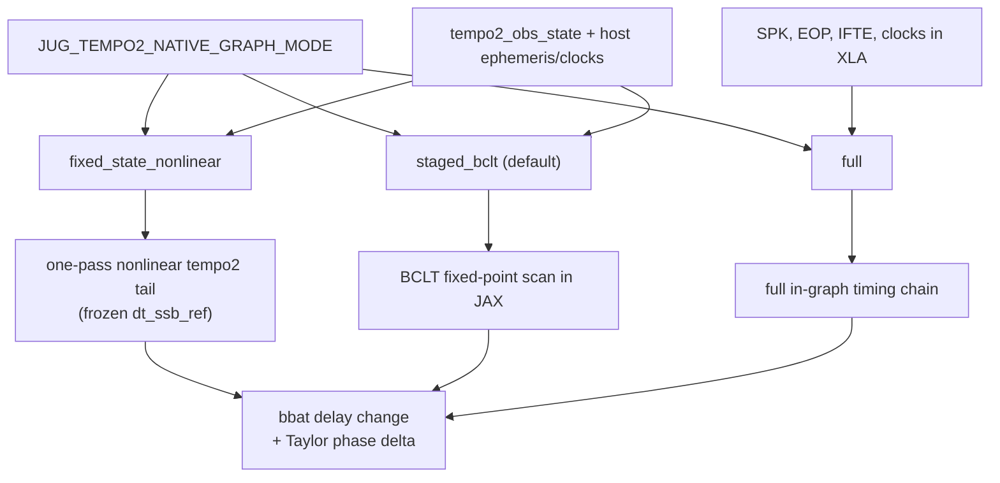

# Tempo2 parity — theory, policy, and definitions

Canonical reference for **what** JUG `compatibility="tempo2"` means, how host
residual parity differs from JAX-traced fitting graphs, and which decisions are
locked.

**Living status and roadmap:** [`PARITY_ROADMAP.md`](PARITY_ROADMAP.md)

**Supporting docs:**

- [`TEST_DATA_MANIFESTO.md`](TEST_DATA_MANIFESTO.md) — fixture provenance and sizes
- [`jug/testing/DEV_ORACLE.md`](jug/testing/DEV_ORACLE.md) — dev oracle harness and test commands
- [`README.md`](README.md) — install, compatibility modes, pytest entry points

*Last updated: 2026-07-08*

---

## 1. What parity is (and is not)

### What JUG parity is

Given a `.par` file and a `.tim` file, pre-fit residuals (and, where gated,
design-matrix columns) from `JUG(compatibility="tempo2")` must match
libstempo/tempo2 on **the same inputs**. Nothing else participates in that
definition.

### What JUG parity is not

- **MetaPulsar has nothing to do with JUG parity.** Notebook or export paths named
  in parity docs are **dataset provenance only** — a way to identify a par+tim pair.
- Green pytest on one curated fixture class does **not** imply end-to-end parity for every
  par/tim pair, θ≠0 NumPy/JAX agreement on real IPTA workloads, or readiness for
  unconstrained production use outside curated tests.
- "Picosecond agreement with PINT" (see §3) is a **PINT-family** claim, not a tempo2
  parity claim.

### Runtime dependencies vs test oracles

**JUG must not depend on libstempo, tempo2, or pytempo.** The shipped package
(`jug-timing` in `pyproject.toml`) has no runtime dependency on any of them.
`compatibility="tempo2"` is implemented **natively inside JUG** (jplephem, native
delay kernels, native phase bookkeeping).

| Package | Runtime JUG | Test / debug only |
|---------|-------------|-------------------|
| **libstempo** + tempo2 | **Must not** | pytest acceptance oracle (`jug/testing/tempo2_reference.py`, vendored `jug/testing/sandbox_tempo2.py`); **maintainer-only fixture generation** (`tools/generate_tempo2_sim_fixtures.py`) |
| **pytempo** | **Must not** | per-TOA diagnostic oracle (`ref-packages/pytempo`, external repo) |

Parity is **defined** by matching tempo2/libstempo on identical par+tim inputs, but
**implemented** without calling them at runtime.

**Simulated committed fixtures (2026-07-08):** libstempo may be used offline to generate
ideal noiseless par/tim pairs under `tests/data_tempo2_sim/`. The generated `.par` and
`.tim` files are committed; normal pytest collection does not invoke libstempo except in
`@pytest.mark.tempo2` oracle tests. Regenerate with
`tools/generate_tempo2_sim_fixtures.py --check`.

---

## 2. Two evaluation layers

Every JUG timing session has two distinct evaluation paths. Conflating them is
the main source of confusion about "picosecond PINT compatibility."

### Layer 1 — Host setup (once, at reference parameters)

`TimingSession.compute_residuals()` / `compute_residuals_simple()` runs the full
host pipeline for the current par file:

- Clock graph and timescale transfer
- Ephemeris and observatory geometry
- Roemer / Shapiro / DM / binary / FD / spin phase bookkeeping
- Compatibility-specific conventions (weighted vs unweighted mean subtraction)

This is what parity tests compare against external codes.

**PINT-family (`compatibility="pint"`):** the JUG↔PINT host-residual difference
depends almost entirely on whether the two codes are given **identical clock and
ephemeris inputs**, not on the timing model:

- **Matched inputs (same ephemeris + clock files + timescale).** The difference
  collapses to a shared **phase-precision floor**. The JUG paper's Fig. 7 reports
  **~5.25 ps RMS** over the NG15 J1909−3744 baseline (35k TOAs), and attributes it
  to the *shared* longdouble-phase strategy that JUG and PINT both use — i.e. they
  track each other far more closely than either tracks exact arithmetic. This is a
  bespoke, carefully-matched comparison, **not** part of the gated test suite.
- **Unmatched inputs (CI default).** The gated fixtures use whatever clock/ephemeris
  files PINT/astropy happen to resolve, so they are gated loosely at **< 50 ns max
  per TOA** (e.g. `J1909_proper`, MPTA-DR3, 100 TOAs: max ~23 ns). The golden file
  itself notes these numbers "drift ~tens of ns as PINT/astropy clock & ephemeris
  files update." Decomposing that difference on `J1909_proper` in a mismatched
  environment: ~**−18 ns is a constant DC phase offset** (arbitrary absolute-phase /
  mean-subtraction convention), leaving only ~**4 ns scatter** consistent with
  clock-file version drift. **None of it is a timing-model disagreement.**

So the honest one-line statement is: *at identical inputs, JUG matches PINT host
residuals to a ps-level shared precision floor; the tens-of-ns seen in CI is a DC
convention offset plus clock/ephemeris data drift.* See `tests/test_pint_parity.py`
and `tests/data_golden/J1909_proper_golden.json`.

**Tempo2-family (`compatibility="tempo2"`):** host residuals vs libstempo are
gated on raw pre-fit δ with ns-scale targets on **curated real and simulated fixtures**;
larger debt is tracked in [`PARITY_ROADMAP.md`](PARITY_ROADMAP.md).

**IPTA DR2 TDB host path (2026-07-08):** mixed-units IPTA DR2 pulsars converted to
`UNITS TDB` are now treated as a first-class tempo2 compatibility target. The host path
matches tempo2's TDB conventions directly: no `IFTE_K` ephemeris scaling for TDB,
tempo1-emulation overrides for `EPHVER < 5`, per-TOA multi-observatory site positions,
legacy `T2C_TEMPO` site vectors where tempo2 would use them, epoch-aware clock chains,
and `longdouble` SAT/TT feedback arithmetic. The remaining IPTA validation debt should
be handled as targeted per-pulsar follow-up, not by defaulting to a full all-pulsar
oracle campaign.

**Ecliptic coordinate frame (2026-07-08):** for ELONG/ELAT (LAMBDA/BETA) pulsars,
tempo2 works in the ecliptic frame end-to-end: `readEphemeris.C` and `get_obsCoord.C`
rotate all `obsn[]` vectors with `equ2ecl` (Earth position+velocity, Sun/planet
positions, site position/velocity) and `vectorPulsar.C` builds `posPulsar` directly
from ecliptic angles. JUG mirrors this via `ecl_obl_rad` on
`compute_tempo2_observatory_state` (host) and `bootstrap_tempo2_geometry_jax`
(in-graph), using `ecliptic_obliquity_rad` (tempo1-emulation aware: 84381.412 vs
84381.4059 arcsec). Troposphere elevation uses `posPulsarEquatorial` (`tropo.C`).
The `tt2tb` obs term `dot(observatory_earth, earth_vel)` is rotation-invariant, so
the Teph bootstrap converges identically in either frame.

**Two-part barycentric time (2026-07-07):** the tempo2-native JAX tail represents
`sat`/`bat`/`bbat` as `(int_day, sec_in_day)` float64 pairs
(`jug/residuals/tempo2/compensated.py`). This removes the ~630 ns ULP
loss from collapsing MJD ~50000 to a single float64 before `phase5@bbat`.
Host TRACK −2 residuals still use Taylor emission spin (libstempo parity); the traced
graph uses `phase5@bbat` for autodiff. Environment preflight:
`tools/tempo2_env_preflight.py` (DE440 / BIPM clock file versions).

### Layer 2 — JAX traced graph (every fit step / MCMC sample)

`make_residual_delta_jax_fn()` (used by `export_jax_timing_state`, MetaPulsar
`JugEngine`, and `design_matrix_method="autodiff"`) evaluates a **local residual
delta** around frozen reference state. It does **not** re-run the full host
barycentric / time-transfer machinery inside XLA on every call.

Instead it:

1. **Freezes** expensive reference state from the host cache (`dt_sec`,
   `tdb_mjd`, `ssb_obs_pos_ls`, `obs_sun_pos_ls`, barycentric frequencies,
   `term_diagnostics`, etc.).
2. **Recomputes nonlinearly in JAX** only the delay/phase pieces that depend on
   fitted parameters (astrometry, DM, binary, FD, spin).
3. Forms the residual delta through spin + delay machinery (see below).

This is **not linearized** astrometry — proper motion, parallax, and Shapiro
geometry update with the perturbed pulsar direction. What is frozen is the
**reference emission/arrival epoch and observer vectors**, not the fitted
parameters themselves.

#### PINT-family path (`compatibility="pint"`)

```text
delay_change = compute_total_delay_change(θ_ref + Δθ, …)
residual_delta(Δθ) = _phase_residual_delta_jax(dt_sec, delay_change, F_ref, F_pert, …)
```

#### Tempo2-family path (`compatibility="tempo2"`)

Absolute native residuals use `phase5@bbat` with `torb = dt_emit − (bbat − PEPOCH)`.
With host `dt_emit` frozen in the fit setup, delay changes **cancel** in
`res(θ+Δθ) − res(θ)` even when geometry/DM move `bbat`. The fitting tangent
therefore does **not** use that subtraction. Instead (2026-07-08):

```text
native_delay_change = −Δbbat_sec   # from two native JAX evals (ref + pert)
binary_delay_change = …            # when binary params are fitted
total_delay_change = native_delay_change + binary_delay_change
residual_delta(Δθ) = _phase_residual_delta_jax(dt_sec, total_delay_change, F_ref, F_pert, …)
```

Implementation: `compute_bbat_delay_change_sec_jax()` in
`jug/residuals/tempo2/terms.py`; dispatch in
`jug/fitting/jax_residual_delta.py`.

**Performance note (deferred):** each call still runs the **full** native tail twice
(BCLT → formBats → Shklovskii → `phase5`) but only reads `bbat` day/sec from the
result. A future **`bbat`-only subgraph** (stop after formBats, skip spin) would
preserve the tangent while avoiding redundant `phase5` work. Tracked in
[`PARITY_ROADMAP.md`](PARITY_ROADMAP.md) Phase 4.

---

## 3. What "picosecond compatibility" means (and does not)

Three *different* comparisons all get called "picosecond" or "nanosecond"
agreement. Keeping them separate resolves essentially all the confusion:

| # | What is compared | Where | Result | Meaning |
|---|------------------|-------|--------|---------|
| **A** | Host residuals, unmatched clock/ephem (MPTA `J1909_proper`, 100 TOAs) | `tests/test_pint_parity.py` | gated **< 50 ns**, measured ~23 ns | Loose CI guard tolerant of clock-file drift |
| **B** | Host residuals, **matched** ephem+clock+timescale (NG15 J1909, 35k TOAs) | paper §5.1 / Fig. 7 | **~5.25 ps RMS** | Shared phase-precision floor between JUG and PINT |
| **C** | JAX traced graph vs JUG's own NumPy fixed-state model | `tests/test_jax_numpy_parity_deprecated.py` (`PICOSECOND = 1e-12`) | **1 ps** | **Internal** JUG consistency, *not* vs PINT |

Comparison **C** asserts:

```text
JAX residual_delta(Δθ)  ≈  NumPy _compute_full_model_residuals residual_delta(Δθ)
```

for small `Δθ`. This is **internal JUG consistency** — the JAX evaluator
faithfully implements JUG's own fixed-state nonlinear model. It is **not** a
claim that JUG JAX matches a PINT full-model recompute at 1 ps for arbitrary
parameter moves. There is **no** test that perturbs parameters and requires JUG
JAX vs PINT `ModelState` at picosecond level.

The paper's headline "agrees with PINT at the picosecond level" is comparison
**B**: a *forward-model, fixed-parameter* result on *one pulsar at matched
inputs*. Two qualifications matter:

1. **ps *with PINT*, not ps *accurate*.** The 5.25 ps largely measures that JUG
   and PINT implement the *same* longdouble-phase trick, so they are correlated
   by construction. It is not evidence of independent correctness against nature.
2. It does **not** characterize the traced/fitting delta layer under
   perturbation (that is comparison C, internal-only), nor the practical
   unmatched-input case (comparison A).

**Scope of the ps claim:** defensible only as *"at identical ephemeris/clock/timescale
inputs, JUG's forward-model residuals agree with PINT to a shared phase-precision
floor (~5 ps on NG15 J1909−3744)."* The ps number is input-matching-limited, not
typical. A PTA-wide distribution (per-pulsar RMS across the NG15 set) would be a
stronger statistical claim than a single figure.

**"Fully independent"** has two meanings that must not be conflated: (a) *does not
call PINT/Tempo2 at runtime* (true), and (b) *validated independently of PINT*
(not what §5.1/§5.2 show — those are agreement-with-PINT tests, and the precision
floor is shared with PINT by construction). Injection-recovery tests (§5.3 in the
paper) are the stronger independent-correctness evidence.

**Traced/fitting path:** the picosecond numbers refer to the forward model at fixed
θ. The JAX traced/fitting delta layer is only tested for *internal* JAX-vs-NumPy
consistency at 1 ps, not against PINT under perturbation.

---

## 4. PINT-compatible path (`compatibility="pint"`)

### What "PINT-compatible" means

`compatibility="pint"` selects **PINT-family runtime conventions**, not a wrapper
around PINT and not a byte-identical reimplementation of PINT's full iterative
BCLT graph at every parameter value.

| Aspect | PINT-compatible JUG behavior |
|--------|------------------------------|
| Ephemeris / observer path | `PintDelayProvider` (Astropy JPL + PINT-family Roemer/Shapiro) |
| Phase mean | Weighted residual mean subtraction |
| Astrometry formulas | PINT-style Roemer + PM + parallax + Shapiro (`derivatives_astrometry.py`) |
| FD design matrix | `pint_phase_scaled` or `delay_only` per setup |
| Host residuals at θ_ref | ~5 ps vs PINT at **matched** ephemeris/clock (paper Fig. 7); tens of ns in CI from DC offset + clock-file drift |

### Fixed-state approximation vs PINT — what is actually frozen

What JUG freezes in the delta layer is only **astrometry-independent** observer
geometry — `ssb_obs_pos_ls`, `obs_sun_pos_ls`, `tdb_mjd`. The astrometry-dependent
pieces (Roemer projection onto the pulsar direction, parallax, solar Shapiro
geometry, proper motion) are **recomputed nonlinearly every call** with the
perturbed parameters:

```python
# jug/fitting/forward_delay.py :: compute_total_delay_change
new_astro = compute_astrometric_delay(
    params, tdb_mjd, setup.ssb_obs_pos_ls,     # frozen SSB→obs vectors
    obs_sun_pos_ls=setup.obs_sun_pos_ls,        # frozen obs→Sun vectors
    ...)
delay_change += new_astro - setup.initial_astrometric_delay
```

**PINT does the same thing.** PINT computes `ssb_obs_pos` once in the TOA table
at `get_TOAs()` and never recomputes it when model parameters change; it only
re-projects onto the pulsar direction. There is **no astrometry-dependent
emission-epoch / BCLT fixed-point iteration in PINT's standard path** for JUG to
omit. So freezing this state is **exact relative to PINT**, not an approximation
of it — which is precisely why matched-input host residuals reach the ps floor
(comparison B above).

Two honest caveats remain:

- **"ps with PINT, not with nature."** Both codes evaluate solar-system geometry
  at the topocentric arrival time and neither iterates an astrometry-dependent
  emission-epoch fixed point. If a more self-consistent model (or tempo2) does,
  JUG and PINT would both differ from it *together*.
- **The one genuinely-frozen astrometry-dependent term** is the barycentric
  frequency feeding the DM delay. Its residual astrometry dependence is
  `O(v/c · δθ)` — femtoseconds for fit-scale astrometry moves — negligible.

**The BCLT-feedback concern is a tempo2-path issue, not a PINT-path issue.**
tempo2's `formBats` genuinely iterates an emission-epoch fixed point, which is
why the tempo2 chain exposes the `fixed_state_nonlinear / staged_bclt / full`
graph modes (§5). The PINT path has nothing analogous to freeze.

### Practical summary (PINT mode)

| Claim | Accurate? |
|-------|-----------|
| PINT-family conventions and analytic astrometry derivatives | Yes |
| Host residuals match PINT at reference θ, **matched** ephem/clock | Yes — ~5 ps shared precision floor (paper Fig. 7) |
| Host residuals match PINT in CI (**unmatched** inputs) | ~tens of ns, dominated by DC phase offset + clock-file drift |
| What JUG freezes in the delta layer is astrometry-independent | Yes — and PINT freezes the same |
| JUG omits an astrometry-dependent BCLT feedback that PINT performs | **No** (that is a tempo2-path concern only) |
| Picosecond tests = JAX vs JUG NumPy fixed-state model | Yes |
| Picosecond tests = JAX vs PINT under perturbation | **No** (no such test exists) |
| "ps with PINT" implies "ps accurate against nature" | **No** — shared phase-precision floor |

When MetaPulsar sets `engines={"pint": "jug"}`, NUTS sees JUG's fixed-state
nonlinear graph with PINT-family conventions — not PINT itself.

---

## 5. Tempo2-compatible path (`compatibility="tempo2"`)

Tempo2 mode uses a **separate native chain** under
`jug/residuals/tempo2/`. Host parity is defined against libstempo on
identical par+tim inputs (§7).

For JAX-traced fitting (`compatibility="tempo2"`), the traced graph uses one of three
user-selectable tempo2-native modes via `JUG_TEMPO2_NATIVE_GRAPH_MODE`.

### Graph mode selector

| Control | Role |
|---------|------|
| `JUG_TEMPO2_NATIVE_GRAPH_MODE` | Selects **which** in-graph tempo2 physics to run for fitting / `residual_delta_jax` |

Requires session cache `term_diagnostics['tempo2_obs_state']` when building
`GeneralFitSetup.native_chain_static`.

### Three tempo2-native graph modes

User-facing control (exact strings only):

```bash
JUG_TEMPO2_NATIVE_GRAPH_MODE={fixed_state_nonlinear,staged_bclt,full}
```

Default when unset: **`staged_bclt`**.



#### Tempo2 autodiff residual delta (2026-07-08)

Host parity residuals and JAX fitting tangents are **different contracts**:

| Layer | Goal | Spin epoch | Delay sensitivity |
|-------|------|------------|-------------------|
| Host (`compute_residuals_simple`) | Match libstempo pre-fit δ | Taylor at emission `model_mjd` (TRACK −2: legacy wrap) | Full host delay chain |
| JAX fit (`residual_delta_jax`) | Correct nonlinear tangent for NUTS / autodiff DM | Taylor via `_phase_residual_delta_jax` | Native **`bbat` displacement** + binary |

Why not `res(θ+Δθ) − res(θ)` on absolute native residuals? The traced graph keeps
host `dt_emit` fixed while recomputing `bbat` from perturbed BCLT/formBats. The
tempo2 closure `torb = dt_emit − (bbat − PEPOCH)` then cancels delay motion in
the forward `phase5@bbat` value — giving **zero geometry columns** even when
autodiff is finite. The fix extracts `−Δbbat` from two native evaluations and
feeds the same precision-safe Taylor machinery the PINT path uses.

**Deferred optimization:** stop the native eval after formBats when only delay
tangents are needed (skip `phase5` in the ref/pert pair). Same BCLT cost, less
per-sample spin work. See [`PARITY_ROADMAP.md`](PARITY_ROADMAP.md) Phase 4.

#### `fixed_state_nonlinear` — fast PTA / NUTS path

Freeze host ephemeris, clocks, and the **reference BCLT epoch** (`dt_ssb_ref_sec`
from term diagnostics at pack-build time). Then recompute tempo2 Roemer, Shapiro,
DM, formBats, Shklovskii, and spin **nonlinearly** for perturbed parameters in a
**single pass** — no BCLT `lax.scan` iteration.

- **Nonlinear:** astrometry, parallax, Shapiro geometry, DM, spin all move with θ.
- **Fixed:** emission/BCLT epoch feedback loop (the self-consistent scan).
- **Analogy:** same structural tradeoff as the PINT-family fixed-state path
  (`compute_total_delay_change` on frozen `dt_sec`), but with tempo2-native
  kernels and conventions.
- **Not:** "PINT-compatible", "linearized", or a substitute for host parity gates.

Use when: regular PTA NUTS / Discovery workloads **after** validation shows
residual and gradient differences vs `staged_bclt` stay below target tolerances
for the parameters and step sizes of interest.

#### `staged_bclt` — fidelity default (production)

Freeze host ephemeris, clocks, and observer staging from `tempo2_obs_state`, but
**recompute the tempo2 BCLT fixed-point iteration**, formBats, Shklovskii, and
TRACK−2 spin in JAX. This is the current production default and the recommended
mode for tempo2 parity work and any analysis where BCLT feedback matters.

Tradeoff: slower compile and eval than `fixed_state_nonlinear`, but preserves
the self-consistent BCLT scan that tempo2 uses when parameters move.

#### `full` — oracle / dev mode

Everything inside the XLA graph: clocks, SPK/EOP/IFTE, tropo, BCLT, etc.
Multi-minute first-compile; for oracle checks and development only — not for
interactive notebooks or large IPTA NUTS runs.

### Naming rationale

| Mode | Name says what it does |
|------|------------------------|
| `fixed_state_nonlinear` | Nonlinear tempo2 tail at **frozen** reference BCLT state (one-pass) |
| `staged_bclt` | Host-frozen staging + **BCLT recomputed** in JAX |
| `full` | Full in-graph chain (no host freeze of clocks/ephemeris) |

Avoid calling `fixed_state_nonlinear` "linearized" or "PINT-compatible." The
fast path is still nonlinear; it omits BCLT iteration feedback, not nonlinearity
in the delay terms themselves.

### Implementation anchors

| Component | Location |
|-----------|----------|
| Mode selector | `jug/residuals/tempo2/graph_config.py` → `tempo2_native_graph_mode()` |
| Pack types | `jug/residuals/tempo2/common.py` — `NativeDeltaPack` |
| Bbat delay change | `jug/residuals/tempo2/terms.py` → `compute_bbat_delay_change_sec_jax()` |
| One-pass BCLT | `jug/residuals/tempo2/calculate_bclt_jax.py` → `compute_bclt_terms_fixed_state_jax()` |
| Residual kernel | `jug/residuals/tempo2/model/fixed_state.py` → `compute_tempo2_toa_model_fixed_state_nonlinear_jax()` |
| JAX dispatch | `jug/fitting/jax_residual_delta.py` → `_compute_residual_delta_jax()` |

`dt_ssb_ref_sec` is sourced from host term diagnostics at pack-build time
(`bclt_dt_ssb_sec`, `dt_ssb_sec`, or nested `tempo2_native_terms`). The hot
residual function must not re-run a reference BCLT solve per sample.

### Validation plan for `fixed_state_nonlinear`

Before promoting the fast mode for production NUTS:

1. **Mode selection tests** — env var parsing, default `staged_bclt`, invalid mode raises.
2. **Gradient sanity** — `jax.grad` finite for `RAJ`, `DECJ`, `F0`, `DM`.
3. **Residual movement** — perturbing astrometry/DM changes residuals.
4. **Parity envelope** — compare `fixed_state_nonlinear` vs `staged_bclt` for
   small PTA-scale perturbations (initial target: max |Δ| < 1 ns on wsrt167-class
   fixtures; tighten after first measurement).

Green host residual gates on Cases A/B/C do **not** automatically certify the
fast graph mode for IPTA-scale traced likelihoods.

### Cross-family comparison

| | PINT-family JAX path | Tempo2 `staged_bclt` | Tempo2 `fixed_state_nonlinear` | Tempo2 `full` |
|---|---------------------|----------------------|-------------------------------|---------------|
| Host parity target | PINT (~5 ps matched inputs; tens of ns in CI) | libstempo (ns gates) | Same host freeze as staged | Oracle only |
| BCLT in graph | No (frozen `dt_sec`) | Yes (iterated scan) | No (frozen `dt_ssb_ref`) | Yes (full chain) |
| Astrometry in graph | Nonlinear (PINT formulas) | Nonlinear (tempo2 native) | Nonlinear (tempo2 native) | Nonlinear (tempo2 native) |
| Default for NUTS | Only option today | **Yes** (tempo2) | Opt-in after validation | Never |
| Picosecond tests | JAX vs JUG NumPy only | JAX internal + staged parity | JAX vs staged envelope | Dev oracle |

---

## 6. Locked decisions (do not reopen without explicit review)

| Question | Decision |
|----------|----------|
| What does `compatibility="tempo2"` mean? | Match tempo2 **residuals and phase conventions end-to-end**, not isolated delay-term tweaks or post-hoc centering tricks. |
| Parity metric for tempo2 mode | **Raw pre-fit residuals** vs libstempo — same gate as `tests/test_tempo2_residual_parity.py` (RMS, p99, max, WRMS on uncentered δ). **Do not** subtract a weighted (or any other) mean for tempo2 acceptance. |
| Phase / mean subtraction | tempo2 uses an **unweighted** phase offset; pint mode uses **weighted**. JUG(tempo2) applies tempo2 phase semantics internally; parity compares residuals **as returned**. |
| Implementation strategy | **Native only.** Reimplement tempo2-equivalent physics inside JUG. **Do not** wrap tempo2, libstempo, or tempo2 plugins at runtime or as a fallback. |
| Runtime dependencies | **No libstempo, tempo2, or pytempo.** Not in `pyproject.toml` dependencies; not importable from `jug/` production modules. Current libstempo use under `jug/testing/` is test-only coupling to remove over time. |
| Test oracle — acceptance | **libstempo** via `jug/testing/tempo2_reference.py` for scalar residual gates (pytest only, optional extra). Oracle use does not permit wrapping tempo2 in the JUG(tempo2) code path. |
| Test oracle — diagnostics | **pytempo** (`ref-packages/pytempo`, separate repo) is the **intended** per-TOA diagnostic oracle. Not a JUG dependency. Several pytempo fields are not yet reliable on IPTA workloads. |
| Shared PINT-family stack in tempo2 mode | On TDB, tempo2 mode must **not** rely on the pint-mode delay pipeline for terms tempo2 implements differently. |
| Ephemeris / Roemer / Shapiro | tempo2-equivalent native table integration and delay geometry. Matching the `EPHEM` keyword alone is insufficient. |
| Omitted par keywords on TDB | Follow **tempo2 implicit defaults** (IF99, DILATEFREQ, etc.) when par omits them — not PINT defaults. |
| TZR / absolute phase | **Mode-specific**: tempo2 native TZR geometry and clocks in tempo2 mode; pint path in pint mode. |
| Demo / notebook display | **Raw δ** for tempo2 compatibility panels. **Weighted-mean-centered δ** only for pint-family-vs-pint-family comparisons. |
| Canonical TCB fixtures | Case A (TCB) must stay green. |
| PINT vs tempo2 cross-engine floor | Closing PINT↔tempo2 gaps inside PINT is **out of scope**. |
| Design matrix in tempo2 mode | Use `design_matrix_method="autodiff"`. **Do not** use `"analytic"` on tempo2 sessions (known broken). |
| Tempo2-native JAX fitting | **Graph modes** (default `staged_bclt`): `JUG_TEMPO2_NATIVE_GRAPH_MODE={fixed_state_nonlinear,staged_bclt,full}`. Requires `term_diagnostics['tempo2_obs_state']` in residual cache for `native_chain_static`. |
| IERS preflight | **Warn** in notebooks / offline use; **strict fail** under pytest or `JUG_IERS_STRICT=1`. |
| Canonical tangent for fitting | tempo2 autodiff / `residual_delta_jax` is the **production tangent** for NUTS/WLS when `design_matrix_method="autodiff"` (wired; IPTA notebook uses it). Remaining work: broaden libstempo design-matrix oracle gates beyond wsrt167 F0 and all graph modes. |

### Tempo2-native graph mode

| Env var | Default | Purpose |
|---------|---------|---------|
| `JUG_TEMPO2_NATIVE_GRAPH_MODE` | `staged_bclt` | Selects which tempo2-native JAX physics to trace for fitting / `residual_delta_jax` |

Supported values (exact strings only): `fixed_state_nonlinear`, `staged_bclt`, `full`.

MetaPulsar / notebook integrators must call `compute_residuals` (or
`force_recompute=True` after JUG upgrades) before `export_jax_timing_state`, and pass
`term_diagnostics` through cached fit-setup builders. See
[`jug/testing/DEV_ORACLE.md`](jug/testing/DEV_ORACLE.md).

---

## 7. Oracle policy

Parity work may use **external oracles** for pytest and debugging. **None** of them are
JUG runtime dependencies, and none may be called from the `compatibility="tempo2"` code
path (`jug/residuals/`, `jug/delays/`, fitters, GUI, etc.).

| Layer | Tool | JUG dependency? | Role |
|-------|------|-----------------|------|
| **Runtime JUG** | `compute_residuals_simple(..., compatibility="tempo2")` | — | Native port under test |
| **Acceptance (scalar gates)** | `jug.testing.tempo2_reference` (libstempo sandbox) | **No** (test-only today) | Raw pre-fit residual RMS / p99 / max for pytest debt pins |
| **Diagnostics (intended)** | [`pytempo`](../../pytempo) → `toa_diagnostics()` / `phase_diagnostics()` | **No** (external repo) | Per-TOA tempo2 term dumps — **partially working** |
| **Legacy (thin)** | `jug.testing.tempo2_diagnostics` (libstempo properties) | **No** (test-only) | Superseded by pytempo when its diagnostic fields are fixed |

### pytempo package

[`ref-packages/pytempo`](../../pytempo) is a standalone tempo2 wrapper built for this
parity project (vendored from libstempo `sandbox`). It exposes per-TOA `obsn[]` fields
that libstempo properties do not surface cleanly.

```python
from pytempo.sandbox import tempopulsar

psr = tempopulsar(parfile=par, timfile=tim, dofit=False)
diag = psr.toa_diagnostics(removemean=False)   # deterministic delay/phase terms
```

Install: `pip install -e ref-packages/pytempo` (requires `$TEMPO2` runtime). Full API:
[`pytempo/README.md`](../../pytempo/README.md).

Key `toa_diagnostics()` fields for parity work:

| Field | Units | Use |
|-------|-------|-----|
| `bbat_mjd`, `bat_mjd`, `pet_mjd` | MJD | Epoch scalars — **not** interchangeable with `bat_corr_days`; split long-double assembly in tempo2 can differ by ~300 ns from float64 `sat + bat_corr` even when delays match (~1 ns). See [`PARITY_ROADMAP.md`](PARITY_ROADMAP.md) § "formBats MJD assembly". |
| `bat_corr_days` | days | Integrated formBats delay correction — primary delay gate |
| `roemer_sec`, `sun_shapiro_sec`, `torb_sec` | seconds | Delay terms |
| `freq_ssb_hz` | Hz | Barycentric frequency |
| `phase_turns`, `nphase` | turns | TRACK −2 / wrapping |
| `phase_offset_turns` | turns | tim ``-padd`` exposure; **not** the same as tempo2 ``addPhase`` from ``pnNew`` |
| `pulse_number` | integer | tim ``-pn`` (use **``pn[i]−pn[0]``** for ``pnAct`` on TRACK −2) |
| `acceptance_residual_sec` | seconds | Tier-1 acceptance oracle (TRACK −2) |

### Comparison conventions

1. **Residual acceptance** — compare raw pre-fit residuals as returned; no post-hoc
   weighted centering for tempo2 gates.
2. **Deterministic term comparison** — call pytempo with `removemean=False` when ranking
   per-TOA delay/phase deltas; mean-subtraction artifacts dominate full-mix vs isolated
   subset comparisons otherwise.
3. **TZRMJD anchoring** — for absolute-phase / TZR workloads, par must carry `TZRMJD`
   (and `TZRSITE`). Compare TZR-sensitive terms with JUG `subtract_tzr=True`.
4. **Subset tim pitfall** — tim ``-pn`` values are offsets relative to **full-tim**
   ``obsn[0]`` (``pn[i]−pn[0]`` equals tempo2 ``pnNew``). Using raw ``-pn`` in ``pnAct``
   breaks TRACK −2 on IPTA exports. Prefer full-tim oracle pull + mask on filtered
   subsets. See TRACK −2 in [`PARITY_ROADMAP.md`](PARITY_ROADMAP.md) § Production behavior.

Diagnostic workflow: [`PARITY_ROADMAP.md`](PARITY_ROADMAP.md) § Debugging workflow.

---

## 8. Fixture matrix

Do not conflate these cases. Full paths and sizes: [`TEST_DATA_MANIFESTO.md`](TEST_DATA_MANIFESTO.md).

| Case | Description | CI status |
|------|-------------|-----------|
| **A. TCB regression** | `tests/data_tempo2/*` with `UNITS=TCB`, IF99, DILATEFREQ, equatorial astrometry | Green (~1–2 ns) |
| **B. NG5 equatorial TDB** | NG5 J1600 after `T2CMETHOD` removal only | Green (~1.7 ns) — TDB host path, `8a1a34d` |
| **C. NG5 ecliptic cross-engine** | Layer-B harmonized par (LAMBDA/BETA, `ECL IERS2003`, DD, TZRMJD) | Green (~1.1 ns) — ecliptic `equ2ecl` obsn[] rotation (see roadmap) |
| **IPTA DR2 J0613** | `epta_j0613_t2_ipta_all` (1369 TOAs), `epta_j0613_t2_nrt1400` (120 TOAs), ad hoc PPTA pairs | Partial — see roadmap |

Case C par keywords (reference):

```text
PSRJ 1600-3053
LAMBDA / BETA / PMLAMBDA / PMBETA
ECL IERS2003
BINARY DD
TZRMJD / TZRFRQ / TZRSITE gbt
UNITS TDB
CLK TT(BIPM2011)
EPHEM DE405
```

---

## 9. Acceptance metrics

`compute_residuals_simple(..., compatibility="tempo2")` raw pre-fit residuals must match
libstempo at:

| Metric | Gate |
|--------|------|
| RMS δ | < 5 ns |
| p99 \|Δ\| | < 10 ns |
| max \|Δ\| | < 25 ns |
| WRMS δ | < 5 ns |

**No weighted-mean centering** in comparisons. Tests: `tests/test_tempo2_residual_parity.py`.

Run tempo2-gated tests:

```bash
cd ref-packages/jug
JUG_TEST_TEMPO2=1 pytest tests/test_tempo2_*.py -q -o addopts=''
```

Requires libstempo + `$TEMPO2` runtime (see [`README.md`](README.md)).

---

## Naming & structure conventions

Inside ``jug/residuals/tempo2/``, internal functions use ``compute_*`` / ``build_*``
without a redundant ``native`` or ``tempo2_native`` infix — the package name already
scopes them. The ``_jax`` suffix is kept where the function is JAX-specific.

Public package exports listed in ``tempo2/__init__.py.__all__`` retain their
``tempo2_native_*`` names for configuration API stability. User-facing configuration
names (``Tempo2NativeConfig``, ``tempo2_native`` kwargs, ``JUG_TEMPO2_NATIVE_GRAPH_MODE``)
are unchanged.

Layout mirrors the PINT path:

| PINT | JUG tempo2 |
|------|------------|
| ``pint/phase.py`` | ``jug/residuals/phase.py`` |
| ``pint/residuals.py`` | ``jug/residuals/host_pipeline.py`` |
| tempo2 host finalize | ``jug/residuals/tempo2/host.py`` |
| JAX model | ``jug/residuals/tempo2/model/`` |
| JAX chain | ``jug/residuals/tempo2/{common,terms,delta_pack,fit_setup,orchestrator}.py`` |

---

## 10. Architecture (delivered)

Phases A–E (2026-06) delivered native tempo2 TDB geometry, mode-specific TZR, CI fixtures,
and design-matrix/fit parity on Case A (TCB).

| Layer | Module | Role |
|-------|--------|------|
| Residual engine | `jug/residuals/simple_calculator.py` | `compute_residuals_simple`, shared phase in `phase.py` |
| Runtime conventions | `jug/residuals/engine_conventions.py` | `EngineConventionProfile` — physics defaults from par + tempo2 implicit rules |
| Diagnostic conventions | `jug/residuals/diagnostic_conventions.py` | Comparison knobs only (`residual_metric`, `term_set`, …) |
| Pint geometry | `PintDelayProvider` | Astropy JPL + PINT-family Roemer/Shapiro |
| Tempo2 TDB geometry | `Tempo2DelayProvider` → `_compute_tempo2_tdb_geometry_terms` | jplephem SPK + tempo2 delay kernels |
| Tempo2 TCB geometry | `Tempo2DelayProvider` → `_compute_tempo2_tcb_geometry_terms` | IFTE + epoch map (Case A) |
| TZR dispatch | `jug/residuals/tzr_geometry.py` | Phase C TZR apply modes; `resolve_tempo2_tzr_apply_mode()` |
| Ephemeris | `jug/delays/tempo2_ephemeris.py` | jplephem DE405 SPK state vectors |
| Tempo2 helpers | `jug/delays/tempo2_geometry.py` | Ecliptic / Roemer-Shapiro helpers |
| Phase / TRACK −2 | `jug/residuals/phase.py` → `compute_phase_residuals()` | Shared; production Taylor + legacy wrap |
| Host finalize (PINT) | `jug/residuals/host_pipeline.py` | PINT-family residual finalization |
| Tempo2 host stage | `jug/residuals/tempo2/host.py` | Clock chain, overlay, finalize |
| Tempo2 spin scaffolding | `jug/residuals/tempo2_spin.py` | ``phase5``, ``track_minus2_frac_phase`` (Phase D) |
| Tempo2-native JAX chain | `jug/residuals/tempo2/` | BCLT, formBats, spin, clock in JAX |
| TRACK −2 oracle | `jug/testing/tempo2_track2_oracle.py` | pnNew / ``phase5@bbat`` harness |
| libstempo acceptance oracle | `jug/testing/tempo2_reference.py` | Scalar residual gates |
| Phase A (legacy oracle) | `jug/testing/tempo2_diagnostics.py`, `phase_a_comparison.py` | libstempo properties — target: pytempo |
| **pytempo diagnostic oracle** | `ref-packages/pytempo` | Per-TOA term dumps — **primary for new debugging** |

**Mode split:** pint and tempo2 diverge in barycentric geometry, engine conventions, TZR
handling, binary param normalization, and mean subtraction (weighted vs unweighted). They
**share** `compute_phase_residuals()` for the phase path.

---

## 11. Non-goals

- Closing the PINT vs tempo2 cross-engine floor **inside PINT**.
- Making `compatibility="pint"` match tempo2.
- Wrapping tempo2 or libstempo inside the JUG(tempo2) runtime path.
- Adding libstempo, tempo2, or pytempo as JUG runtime or `pyproject.toml` dependencies.
- Using weighted-mean-centered residuals for tempo2 acceptance.

---

## 12. FAQ

**Q: Which oracle for debugging?**  
A: **pytempo** `toa_diagnostics()` for per-TOA term dumps. See [`PARITY_ROADMAP.md`](PARITY_ROADMAP.md) § Debugging workflow.

**Q: Which oracle for CI green?**  
A: **libstempo** raw residuals via `tempo2_reference()` — unchanged acceptance gates.

**Q: Should tempo2 parity tests subtract a weighted mean?**  
A: **No.** Compare raw residuals as returned.

**Q: Can we call libstempo or tempo2 inside `compatibility="tempo2"`?**  
A: **No** at runtime. External oracles for pytest/debug only.

**Q: Is libstempo a JUG dependency?**  
A: **No.** It is used in the test harness today (`jug/testing/`). That coupling is a
mistake to unwind — JUG must remain installable and runnable without libstempo.

**Q: Is pytempo a JUG dependency?**  
A: **No.** It lives in `ref-packages/pytempo` as an optional external diagnostic tool.

**Q: Why do TCB tests pass but IPTA full-TIM does not?**  
A: Case A activates IFTE, TCB epoch mapping, and unweighted phase mean. IPTA multi-backend
debt is phase-bookkeeping and per-group offsets — see roadmap, not missing TCB machinery.

**Q: Why does weighted-centering make JUG(tempo2) look like JUG(pint)?**  
A: On some TDB models delay shapes correlate; centering removes the ~61 ns phase-offset
signal from mean-subtraction convention differences and hides the libstempo gap.

**Q: Is `design_matrix_method="analytic"` OK in tempo2 mode?**  
A: **No.** Use `"autodiff"`.

---

## 13. Recommendations

### PINT-family (`compatibility="pint"`)

- Keep the three comparisons (A/B/C above) **separate**: matched-input host
  parity (~ps), CI host parity (~tens of ns from DC offset + clock drift), and
  internal JAX/NumPy parity (~ps, not vs PINT).
- Do **not** say JUG's frozen delta layer "omits BCLT feedback PINT performs" —
  PINT freezes the same astrometry-independent state; freezing is exact relative
  to PINT. (The BCLT fixed-point concern belongs to the tempo2 path only.)
- When quoting the paper's ps result, qualify it as **forward-model, fixed-θ,
  matched-input, ps *with PINT*** (shared precision floor) — not ps accurate
  against nature, and not a statement about the traced/fitting delta layer.
- Describe the traced graph as **fixed-state nonlinear with PINT-family
  conventions**, seeded by a full host solve at θ_ref.

### Tempo2-family (`compatibility="tempo2"`)

- Keep **`staged_bclt`** as the fidelity default for tempo2 JAX fitting and
  parity regression work.
- Add **`fixed_state_nonlinear`** as an explicit opt-in for PTA NUTS once
  envelope tests vs `staged_bclt` pass on representative workloads.
- Reserve **`full`** for oracle checks and development (`jug/testing/DEV_ORACLE.md`).

### MetaPulsar / `export_jax_timing_state`

Regardless of compatibility family:

1. Call `session.compute_residuals()` (or `force_recompute=True` after upgrades)
   before exporting JAX state.
2. For tempo2: ensure `term_diagnostics['tempo2_obs_state']` is present.
3. Understand that `residual_delta_jax` is always a **delta around the frozen
   reference state**, not a full host recompute per MCMC step.
