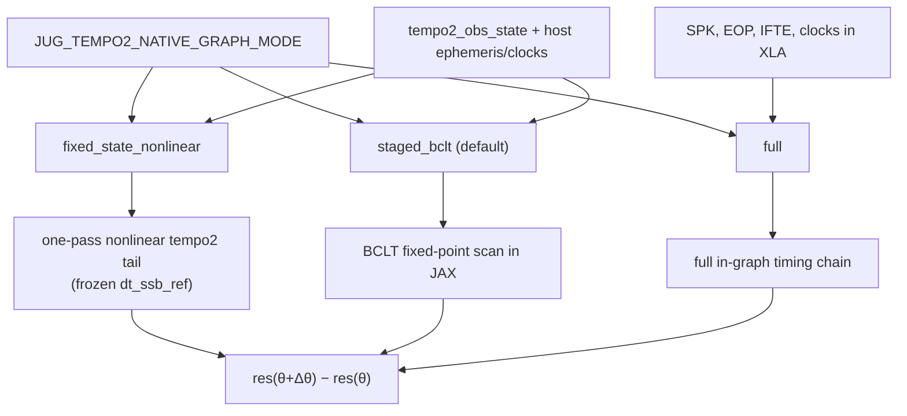

# Timing graph accuracy notes

Living reference for what JUG's **JAX-traced timing graphs** actually guarantee,
how that differs from **host residual parity** against PINT or tempo2, and how
the planned tempo2-native graph modes relate to the existing PINT-family path.

**Related docs:**

- [`README.md`](README.md) — compatibility families and quick-start switches
- [`TEMPO2_COMPATIBILITY.md`](TEMPO2_COMPATIBILITY.md) — tempo2 policy and acceptance metrics
- [`TEMPO2_PARITY.md`](TEMPO2_PARITY.md) — measured tempo2 parity debt and work queue

---

## Two layers: host setup vs traced graph

Every JUG timing session has two distinct evaluation paths. Conflating them is
the main source of confusion about "picosecond PINT compatibility."

### Layer 1 — Host setup (once, at reference parameters)

`TimingSession.compute_residuals()` / `compute_residuals_simple()` runs the full
host pipeline for the current par file:

- Clock graph and timescale transfer
- Ephemeris and observatory geometry
- Roemer / Shapiro / DM / binary / FD / spin phase bookkeeping
- Compatibility-specific conventions (weighted vs unweighted mean subtraction)

This is what parity tests compare against external codes.

**PINT-family (`compatibility="pint"`):** the JUG↔PINT host-residual difference
depends almost entirely on whether the two codes are given **identical clock and
ephemeris inputs**, not on the timing model:

- **Matched inputs (same ephemeris + clock files + timescale).** The difference
  collapses to a shared **phase-precision floor**. The JUG paper's Fig. 7 reports
  **~5.25 ps RMS** over the NG15 J1909−3744 baseline (35k TOAs), and attributes it
  to the *shared* longdouble-phase strategy that JUG and PINT both use — i.e. they
  track each other far more closely than either tracks exact arithmetic. This is a
  bespoke, carefully-matched comparison, **not** part of the gated test suite.
- **Unmatched inputs (CI default).** The gated fixtures use whatever clock/ephemeris
  files PINT/astropy happen to resolve, so they are gated loosely at **< 50 ns max
  per TOA** (e.g. `J1909_proper`, MPTA-DR3, 100 TOAs: max ~23 ns). The golden file
  itself notes these numbers "drift ~tens of ns as PINT/astropy clock & ephemeris
  files update." Decomposing that difference on `J1909_proper` in a mismatched
  environment: ~**−18 ns is a constant DC phase offset** (arbitrary absolute-phase /
  mean-subtraction convention), leaving only ~**4 ns scatter** consistent with
  clock-file version drift. **None of it is a timing-model disagreement.**

So the honest one-line statement is: *at identical inputs, JUG matches PINT host
residuals to a ps-level shared precision floor; the tens-of-ns seen in CI is a DC
convention offset plus clock/ephemeris data drift.* See `tests/test_pint_parity.py`
and `tests/data_golden/J1909_proper_golden.json`.

**Tempo2-family (`compatibility="tempo2"`):** host residuals vs libstempo are
gated on raw pre-fit δ with ns-scale targets on curated Cases A/B/C; IPTA-scale
debt is tracked in [`TEMPO2_PARITY.md`](TEMPO2_PARITY.md).

### Layer 2 — JAX traced graph (every fit step / MCMC sample)

`make_residual_delta_jax_fn()` (used by `export_jax_timing_state`, MetaPulsar
`JugEngine`, and `design_matrix_method="autodiff"`) evaluates

```text
residual_delta(Δθ) = residual_sec(θ_ref + Δθ) − residual_sec(θ_ref)
```

through a **fixed-state nonlinear** forward model. It does **not** re-run the
full host barycentric / time-transfer machinery inside XLA on every call.

Instead it:

1. **Freezes** expensive reference state from the host cache (`dt_sec`,
   `tdb_mjd`, `ssb_obs_pos_ls`, `obs_sun_pos_ls`, barycentric frequencies,
   `term_diagnostics`, etc.).
2. **Recomputes nonlinearly in JAX** only the delay/phase pieces that depend on
   fitted parameters (astrometry, DM, binary, FD, spin).
3. Forms the residual delta via the same spin + delay Taylor machinery in both
   NumPy (`_compute_full_model_residuals`) and JAX.

This is **not linearized** astrometry — proper motion, parallax, and Shapiro
geometry update with the perturbed pulsar direction. What is frozen is the
**reference emission/arrival epoch and observer vectors**, not the fitted
parameters themselves.

---

## PINT-compatible path (`compatibility="pint"`)

### What "PINT-compatible" means

`compatibility="pint"` selects **PINT-family runtime conventions**, not a wrapper
around PINT and not a byte-identical reimplementation of PINT's full iterative
BCLT graph at every parameter value.

Concretely:

| Aspect | PINT-compatible JUG behavior |
|--------|------------------------------|
| Ephemeris / observer path | `PintDelayProvider` (Astropy JPL + PINT-family Roemer/Shapiro) |
| Phase mean | Weighted residual mean subtraction |
| Astrometry formulas | PINT-style Roemer + PM + parallax + Shapiro (`derivatives_astrometry.py`) |
| FD design matrix | `pint_phase_scaled` or `delay_only` per setup |
| Host residuals at θ_ref | ~5 ps vs PINT at **matched** ephemeris/clock (paper Fig. 7); tens of ns in CI from DC offset + clock-file drift |

### What "picosecond compatibility" means (and does not)

Three *different* comparisons all get called "picosecond" or "nanosecond"
agreement. Keeping them separate resolves essentially all the confusion:

| # | What is compared | Where | Result | Meaning |
|---|------------------|-------|--------|---------|
| **A** | Host residuals, unmatched clock/ephem (MPTA `J1909_proper`, 100 TOAs) | `tests/test_pint_parity.py` | gated **< 50 ns**, measured ~23 ns | Loose CI guard tolerant of clock-file drift |
| **B** | Host residuals, **matched** ephem+clock+timescale (NG15 J1909, 35k TOAs) | paper §5.1 / Fig. 7 | **~5.25 ps RMS** | Shared phase-precision floor between JUG and PINT |
| **C** | JAX traced graph vs JUG's own NumPy fixed-state model | `tests/test_jax_numpy_parity_deprecated.py` (`PICOSECOND = 1e-12`) | **1 ps** | **Internal** JUG consistency, *not* vs PINT |

Comparison **C** asserts:

```text
JAX residual_delta(Δθ)  ≈  NumPy _compute_full_model_residuals residual_delta(Δθ)
```

for small `Δθ`. This is **internal JUG consistency** — the JAX evaluator
faithfully implements JUG's own fixed-state nonlinear model. It is **not** a
claim that JUG JAX matches a PINT full-model recompute at 1 ps for arbitrary
parameter moves. There is **no** test that perturbs parameters and requires JUG
JAX vs PINT `ModelState` at picosecond level.

The paper's headline "agrees with PINT at the picosecond level" is comparison
**B**: a *forward-model, fixed-parameter* result on *one* pulsar at *matched*
inputs. It is real, but two qualifications matter:

1. **ps *with PINT*, not ps *accurate*.** The 5.25 ps largely measures that JUG
   and PINT implement the *same* longdouble-phase trick, so they are correlated
   by construction (the paper says as much). It is not evidence of independent
   correctness against nature.
2. It does **not** characterize the traced/fitting delta layer under
   perturbation (that is comparison C, internal-only), nor the practical
   unmatched-input case (comparison A).

### Fixed-state approximation vs PINT — what is actually frozen

**Correction to an earlier framing in this doc.** It is tempting to say JUG's
fixed-state path "omits the self-consistent BCLT feedback that PINT performs at
each step." For the **PINT path this is wrong**, and it matters for reasoning
about picosecond parity.

What JUG freezes in the delta layer is only **astrometry-independent** observer
geometry — `ssb_obs_pos_ls`, `obs_sun_pos_ls`, `tdb_mjd`. The astrometry-dependent
pieces (Roemer projection onto the pulsar direction, parallax, solar Shapiro
geometry, proper motion) are **recomputed nonlinearly every call** with the
perturbed parameters:

```python
# jug/fitting/forward_delay.py :: compute_total_delay_change
new_astro = compute_astrometric_delay(
    params, tdb_mjd, setup.ssb_obs_pos_ls,     # frozen SSB→obs vectors
    obs_sun_pos_ls=setup.obs_sun_pos_ls,        # frozen obs→Sun vectors
    ...)
delay_change += new_astro - setup.initial_astrometric_delay
```

**PINT does the same thing.** PINT computes `ssb_obs_pos` once in the TOA table
at `get_TOAs()` and never recomputes it when model parameters change; it only
re-projects onto the pulsar direction. There is **no astrometry-dependent
emission-epoch / BCLT fixed-point iteration in PINT's standard path** for JUG to
omit. So freezing this state is **exact relative to PINT**, not an approximation
of it — which is precisely why matched-input host residuals reach the ps floor
(comparison B above).

Two honest caveats remain:

- **"ps with PINT, not with nature."** Both codes evaluate solar-system geometry
  at the topocentric arrival time and neither iterates an astrometry-dependent
  emission-epoch fixed point. If a more self-consistent model (or tempo2) does,
  JUG and PINT would both differ from it *together*. They agree with each other
  at ps; absolute accuracy is a separate, untested question.
- **The one genuinely-frozen astrometry-dependent term** is the barycentric
  frequency feeding the DM delay. Its residual astrometry dependence is
  `O(v/c · δθ)` — femtoseconds for fit-scale astrometry moves — negligible.

**The BCLT-feedback concern is a tempo2-path issue, not a PINT-path issue.**
tempo2's `formBats` genuinely iterates an emission-epoch fixed point, which is
why the tempo2 chain exposes the `fixed_state_nonlinear / staged_bclt / full`
graph modes (below). The PINT path has nothing analogous to freeze.

### Practical summary (PINT mode)

| Claim | Accurate? |
|-------|-----------|
| PINT-family conventions and analytic astrometry derivatives | Yes |
| Host residuals match PINT at reference θ, **matched** ephem/clock | Yes — ~5 ps shared precision floor (paper Fig. 7) |
| Host residuals match PINT in CI (**unmatched** inputs) | ~tens of ns, dominated by DC phase offset + clock-file drift |
| What JUG freezes in the delta layer is astrometry-independent | Yes — and PINT freezes the same |
| JUG omits an astrometry-dependent BCLT feedback that PINT performs | **No** (that is a tempo2-path concern only) |
| Picosecond tests = JAX vs JUG NumPy fixed-state model | Yes |
| Picosecond tests = JAX vs PINT under perturbation | **No** (no such test exists) |
| "ps with PINT" implies "ps accurate against nature" | **No** — shared phase-precision floor |

When MetaPulsar sets `engines={"pint": "jug"}`, NUTS sees JUG's fixed-state
nonlinear graph with PINT-family conventions — not PINT itself.

---

## Tempo2-compatible path (`compatibility="tempo2"`)

Tempo2 mode uses a **separate native chain** under
`jug/residuals/tempo2_native/`. Host parity is defined against libstempo on
identical par+tim inputs ([`TEMPO2_COMPATIBILITY.md`](TEMPO2_COMPATIBILITY.md)).

For JAX-traced fitting (`compatibility="tempo2"`), the traced graph uses one of three
user-selectable tempo2-native modes via `JUG_TEMPO2_NATIVE_GRAPH_MODE`.

### Graph mode selector

| Control | Role |
|---------|------|
| `JUG_TEMPO2_NATIVE_GRAPH_MODE` | Selects **which** in-graph tempo2 physics to run for fitting / `residual_delta_jax` |

Requires session cache `term_diagnostics['tempo2_obs_state']` when building
`GeneralFitSetup.native_chain_static`.

### Three tempo2-native graph modes

User-facing control (exact strings only):

```bash
JUG_TEMPO2_NATIVE_GRAPH_MODE={fixed_state_nonlinear,staged_bclt,full}
```

Default when unset: **`staged_bclt`**.



#### `fixed_state_nonlinear` — fast PTA / NUTS path

Freeze host ephemeris, clocks, and the **reference BCLT epoch** (`dt_ssb_ref_sec`
from term diagnostics at pack-build time). Then recompute tempo2 Roemer, Shapiro,
DM, formBats, Shklovskii, and spin **nonlinearly** for perturbed parameters in a
**single pass** — no BCLT `lax.scan` iteration.

- **Nonlinear:** astrometry, parallax, Shapiro geometry, DM, spin all move with θ.
- **Fixed:** emission/BCLT epoch feedback loop (the self-consistent scan).
- **Analogy:** same structural tradeoff as the PINT-family fixed-state path
  (`compute_total_delay_change` on frozen `dt_sec`), but with tempo2-native
  kernels and conventions.
- **Not:** "PINT-compatible", "linearized", or a substitute for host parity gates.

Use when: regular PTA NUTS / Discovery workloads **after** validation shows
residual and gradient differences vs `staged_bclt` stay below target tolerances
for the parameters and step sizes of interest.

#### `staged_bclt` — fidelity default (production)

Freeze host ephemeris, clocks, and observer staging from `tempo2_obs_state`, but
**recompute the tempo2 BCLT fixed-point iteration**, formBats, Shklovskii, and
TRACK−2 spin in JAX. This is the current production default and the recommended
mode for tempo2 parity work and any analysis where BCLT feedback matters.

Tradeoff: slower compile and eval than `fixed_state_nonlinear`, but preserves
the self-consistent BCLT scan that tempo2 uses when parameters move.

#### `full` — oracle / dev mode

Everything inside the XLA graph: clocks, SPK/EOP/IFTE, tropo, BCLT, etc.
Multi-minute first-compile; for oracle checks and development only — not for
interactive notebooks or large IPTA NUTS runs.

### Naming rationale

| Mode | Name says what it does |
|------|------------------------|
| `fixed_state_nonlinear` | Nonlinear tempo2 tail at **frozen** reference BCLT state (one-pass) |
| `staged_bclt` | Host-frozen staging + **BCLT recomputed** in JAX |
| `full` | Full in-graph chain (no host freeze of clocks/ephemeris) |

Avoid calling `fixed_state_nonlinear` "linearized" or "PINT-compatible." The
fast path is still nonlinear; it omits BCLT iteration feedback, not nonlinearity
in the delay terms themselves.

### Planned implementation anchors

| Component | Location |
|-----------|----------|
| Mode selector | `jug/residuals/tempo2_graph_config.py` → `tempo2_native_graph_mode()` |
| Pack types | `jug/residuals/tempo2_native/chain_jax.py` — `NativeDeltaPack` (mode field; staged/full/fixed_state) |
| One-pass BCLT | `jug/residuals/tempo2_native/calculate_bclt_jax.py` → `compute_bclt_terms_fixed_state_jax()` |
| Residual kernel | `jug/residuals/tempo2_native/model_jax.py` → `compute_tempo2_toa_model_fixed_state_nonlinear_jax()` |
| JAX dispatch | `jug/fitting/jax_residual_delta.py` → `_compute_residual_delta_jax()` |

`dt_ssb_ref_sec` is sourced from host term diagnostics at pack-build time
(`bclt_dt_ssb_sec`, `dt_ssb_sec`, or nested `tempo2_native_terms`). The hot
residual function must not re-run a reference BCLT solve per sample.

### Validation plan for `fixed_state_nonlinear`

Before promoting the fast mode for production NUTS:

1. **Mode selection tests** — env var parsing, default `staged_bclt`, invalid mode raises.
2. **Gradient sanity** — `jax.grad` finite for `RAJ`, `DECJ`, `F0`, `DM`.
3. **Residual movement** — perturbing astrometry/DM changes residuals.
4. **Parity envelope** — compare `fixed_state_nonlinear` vs `staged_bclt` for
   small PTA-scale perturbations (initial target: max |Δ| < 1 ns on wsrt167-class
   fixtures; tighten after first measurement).

Green host residual gates on Cases A/B/C do **not** automatically certify the
fast graph mode for IPTA-scale traced likelihoods.

---

## Cross-family comparison

| | PINT-family JAX path | Tempo2 `staged_bclt` | Tempo2 `fixed_state_nonlinear` | Tempo2 `full` |
|---|---------------------|----------------------|-------------------------------|---------------|
| Host parity target | PINT (~tens of ns) | libstempo (ns gates) | Same host freeze as staged | Oracle only |
| BCLT in graph | No (frozen `dt_sec`) | Yes (iterated scan) | No (frozen `dt_ssb_ref`) | Yes (full chain) |
| Astrometry in graph | Nonlinear (PINT formulas) | Nonlinear (tempo2 native) | Nonlinear (tempo2 native) | Nonlinear (tempo2 native) |
| Default for NUTS | Only option today | **Yes** (tempo2) | Opt-in after validation | Never |
| Picosecond tests | JAX vs JUG NumPy only | JAX internal + staged parity | JAX vs staged envelope | Dev oracle |

---

## Recommendations

### PINT-family (`compatibility="pint"`)

- Treat host PINT parity (~tens of ns at θ_ref) and internal picosecond JAX/NumPy
  parity as **separate guarantees**.
- Do not describe the traced graph as "picosecond compatible with PINT."
- Describe it as **fixed-state nonlinear with PINT-family conventions**, seeded
  by a full host solve at θ_ref.

### Tempo2-family (`compatibility="tempo2"`)

- Keep **`staged_bclt`** as the fidelity default for tempo2 JAX fitting and
  parity regression work.
- Add **`fixed_state_nonlinear`** as an explicit opt-in for PTA NUTS once
  envelope tests vs `staged_bclt` pass on representative workloads.
- Reserve **`full`** for oracle checks and development (`jug/testing/DEV_ORACLE.md`).

### MetaPulsar / `export_jax_timing_state`

Regardless of compatibility family:

1. Call `session.compute_residuals()` (or `force_recompute=True` after upgrades)
   before exporting JAX state.
2. For tempo2: ensure `term_diagnostics['tempo2_obs_state']` is present.
3. Understand that `residual_delta_jax` is always a **delta around the frozen
   reference state**, not a full host recompute per MCMC step.

---

## Status

| Item | Status |
|------|--------|
| PINT-family fixed-state JAX path | **Shipped** — documented accuracy scope above |
| Tempo2 `staged_bclt` (current default) | **Shipped** — see [`TEMPO2_PARITY.md`](TEMPO2_PARITY.md) |
| Tempo2 `fixed_state_nonlinear` | **Shipped** — one-pass nonlinear tail without BCLT scan |
| Tempo2 `full` | **Shipped** — oracle/dev unified in-graph model (`JUG_TEMPO2_NATIVE_GRAPH_MODE=full`) |

*Last updated: 2026-07-07*
