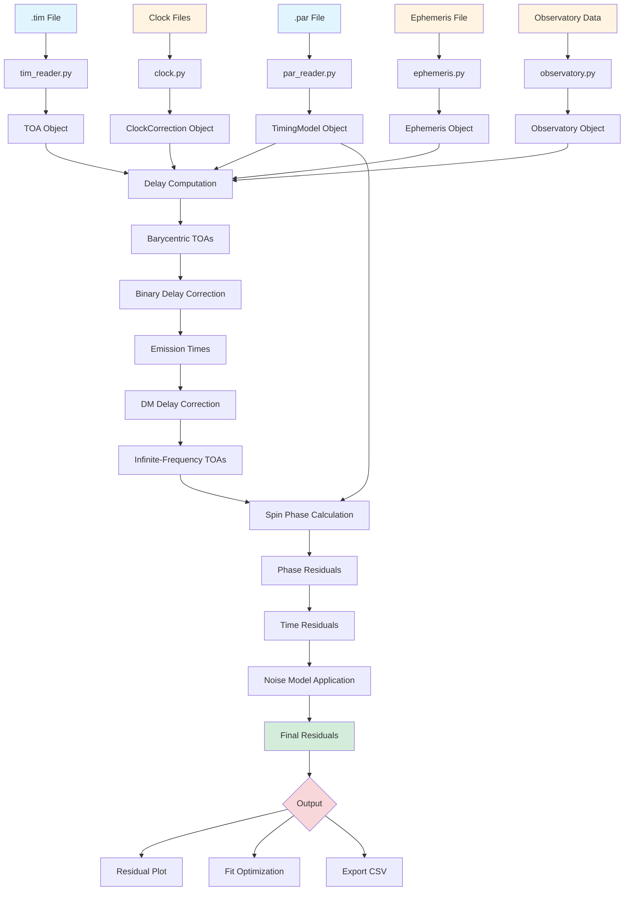
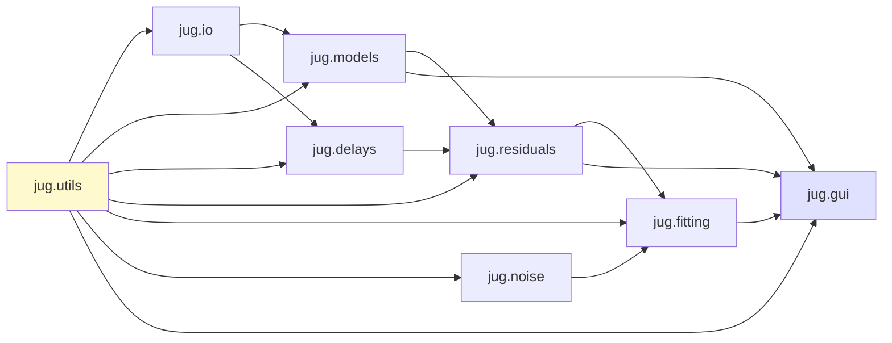
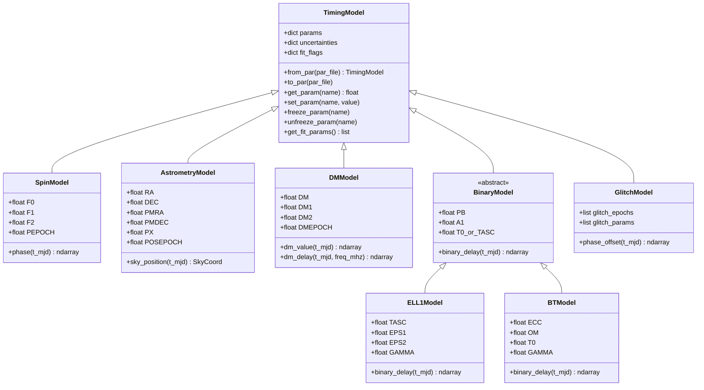
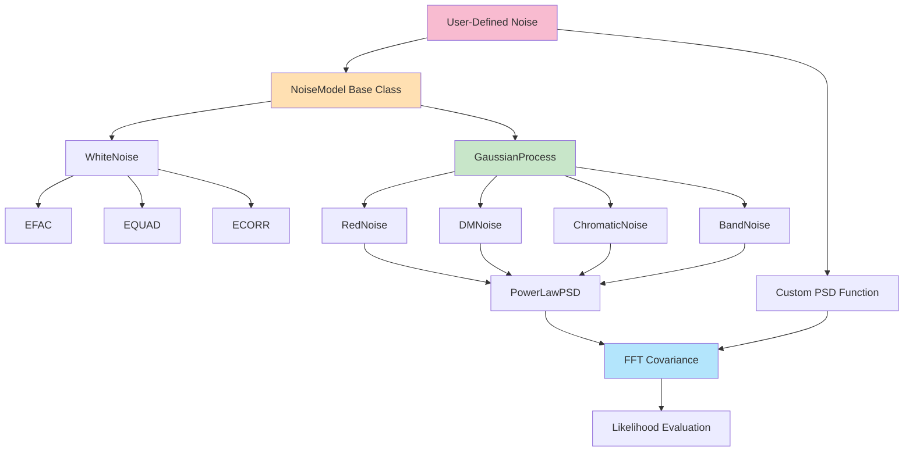
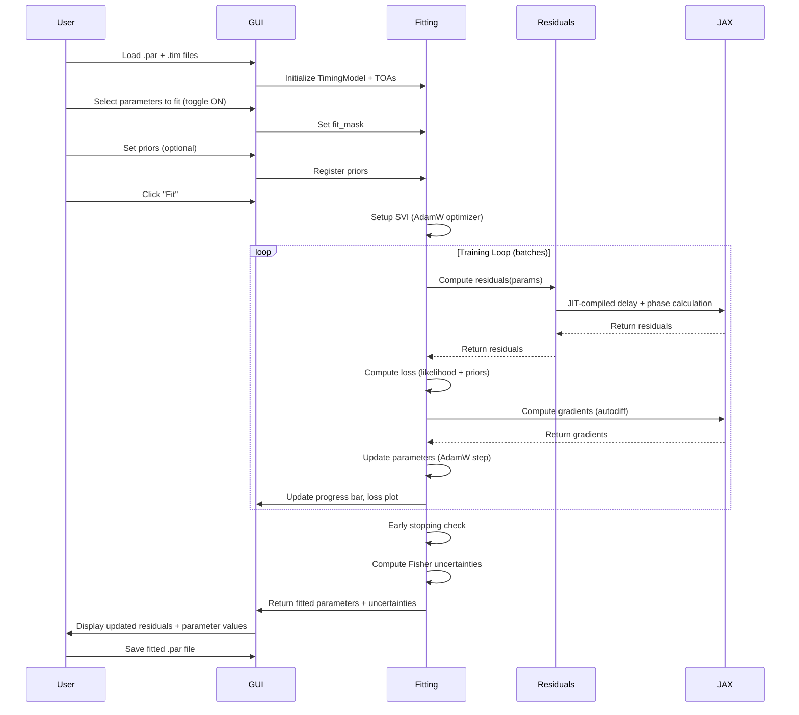
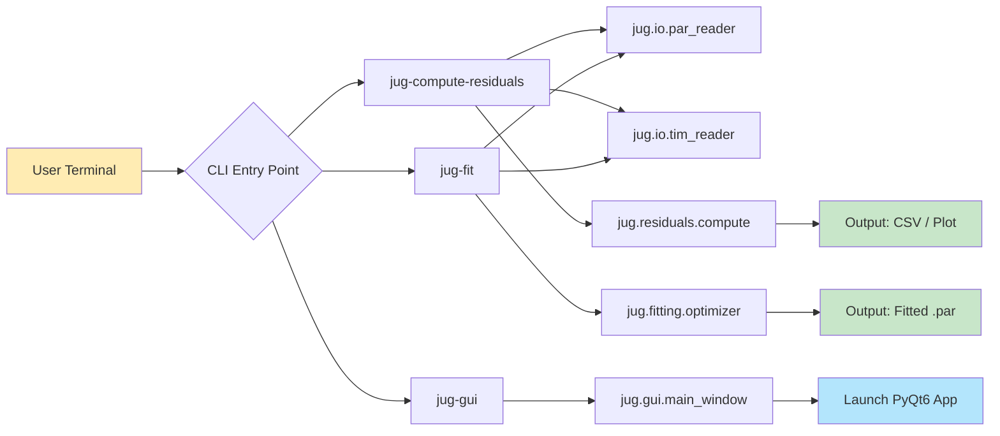
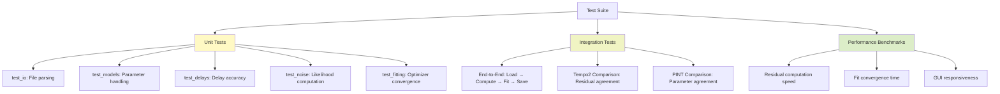
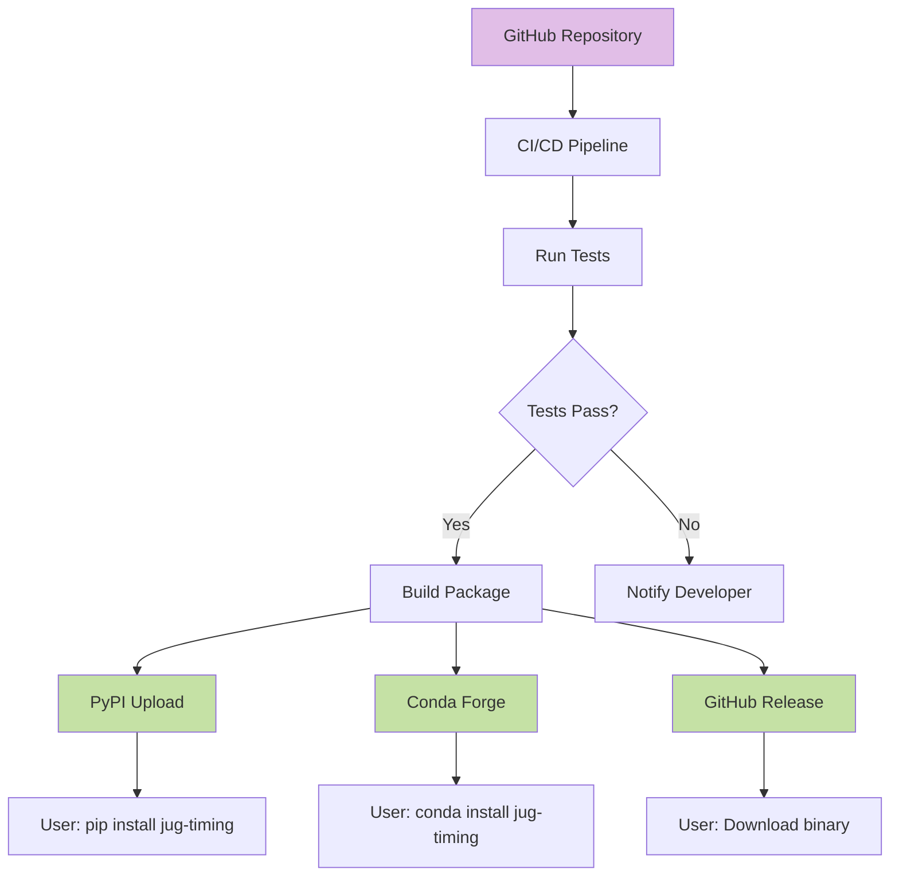

# JUG Package Architecture and Flowcharts

**Version**: 1.0
**Date**: 2025-11-29

This document provides visual representations of JUG's package structure, data flow, and component relationships.

---

## 1. High-Level Package Structure

```
jug/
├── jug/                           # Main package directory
│   ├── __init__.py                # Package initialization, version info
│   │
│   ├── io/                        # Input/Output module
│   │   ├── __init__.py
│   │   ├── par_reader.py          # Parse .par files (timing parameters)
│   │   ├── tim_reader.py          # Parse .tim files (TOAs)
│   │   ├── par_writer.py          # Write updated .par files
│   │   ├── tim_writer.py          # Write flagged .tim files
│   │   ├── clock.py               # Clock correction file handling
│   │   ├── ephemeris.py           # Ephemeris file loading (SPK)
│   │   ├── observatory.py         # Observatory data parsing
│   │   └── session.py             # Session save/load (.jug files)
│   │
│   ├── models/                    # Timing model classes
│   │   ├── __init__.py
│   │   ├── base.py                # Base timing model class
│   │   ├── spin.py                # Spin model (F0, F1, F2, ...)
│   │   ├── astrometry.py          # Astrometric model (RA, DEC, PM, PX)
│   │   ├── dm.py                  # Dispersion measure model (DM, DM1, DM2, ...)
│   │   ├── binary.py              # Binary model base class
│   │   ├── binary_ell1.py         # ELL1/ELL1H model
│   │   ├── binary_bt.py           # BT/DD/DDH/T2 models
│   │   ├── glitch.py              # Glitch model (GLEP, GLPH, GLF0, ...)
│   │   ├── fd.py                  # Frequency-dependent parameters
│   │   └── solar_wind.py          # Solar wind model (NE_SW)
│   │
│   ├── delays/                    # Delay computation functions
│   │   ├── __init__.py
│   │   ├── clock_correction.py    # Observatory clock → TT chain
│   │   ├── barycentric.py         # Roemer + Einstein + Shapiro (SSB)
│   │   ├── binary_delay.py        # Binary orbital delays
│   │   ├── dm_delay.py            # Dispersion measure delay (K_DM * DM / freq^2)
│   │   ├── shapiro_planets.py     # Planetary Shapiro delays
│   │   ├── fd_delay.py            # Frequency-dependent delays
│   │   └── combined.py            # Combined delay calculation (JAX-compiled)
│   │
│   ├── noise/                     # Noise model framework
│   │   ├── __init__.py
│   │   ├── base.py                # Base noise model class
│   │   ├── white.py               # White noise (EFAC, EQUAD, ECORR)
│   │   ├── gp.py                  # Gaussian process framework
│   │   ├── fft_covariance.py      # FFT covariance method (psd2cov)
│   │   ├── red_noise.py           # Power-law achromatic red noise
│   │   ├── dm_noise.py            # Power-law DM variations
│   │   ├── chromatic_noise.py     # Power-law scattering noise
│   │   ├── band_noise.py          # Band-specific correlated noise
│   │   └── registry.py            # User-defined noise model registration
│   │
│   ├── fitting/                   # Optimization and fitting
│   │   ├── __init__.py
│   │   ├── optimizer.py           # AdamW + cosine decay (from pulsar-map-noise-estimates)
│   │   ├── svi.py                 # NumPyro SVI setup
│   │   ├── parameter_mask.py      # Incremental fitting (freeze/unfreeze params)
│   │   ├── priors.py              # Bayesian prior specification
│   │   ├── fisher.py              # Fisher matrix uncertainties
│   │   ├── mcmc.py                # Optional: HMC/NUTS sampling
│   │   └── loss.py                # Likelihood functions (JAX-compatible)
│   │
│   ├── residuals/                 # Residual calculation engine
│   │   ├── __init__.py
│   │   ├── compute.py             # Main residual computation (JAX-compiled)
│   │   ├── phase.py               # Spin phase calculation (Horner's method)
│   │   └── utils.py               # Helper functions (MJD conversions, etc.)
│   │
│   ├── gui/                       # PyQt6 GUI components
│   │   ├── __init__.py
│   │   ├── main_window.py         # Main application window
│   │   ├── residual_plot.py       # Residual plot panel
│   │   ├── parameter_panel.py     # Parameter control panel
│   │   ├── noise_diagnostics.py   # Noise diagnostic plots (PSD, ACF, etc.)
│   │   ├── fit_control.py         # Fit control panel
│   │   ├── file_menu.py           # File operations menu
│   │   ├── session_manager.py     # Session save/load UI
│   │   └── dialogs.py             # Custom dialogs (priors, settings, etc.)
│   │
│   ├── utils/                     # Utility functions
│   │   ├── __init__.py
│   │   ├── constants.py           # Physical constants (C, AU, K_DM, L_B, etc.)
│   │   ├── time.py                # Time scale conversions (TCB/TDB, MJD/JD)
│   │   ├── coordinates.py         # Coordinate transformations
│   │   ├── config.py              # Configuration file handling
│   │   └── logging.py             # Logging setup
│   │
│   └── tests/                     # Unit and integration tests
│       ├── __init__.py
│       ├── test_io/               # Tests for I/O module
│       ├── test_models/           # Tests for timing models
│       ├── test_delays/           # Tests for delay calculations
│       ├── test_noise/            # Tests for noise models
│       ├── test_fitting/          # Tests for optimization
│       ├── test_residuals/        # Tests for residual computation
│       ├── test_gui/              # Tests for GUI components
│       ├── fixtures/              # Test data (.par, .tim, synthetic)
│       └── benchmarks/            # Performance benchmarks
│
├── data/                          # Reference data (not in Python package)
│   ├── clock/                     # Clock correction files
│   │   ├── mk2utc.clk
│   │   ├── utc2tai.clk
│   │   └── tai2tt_bipm*.clk
│   ├── ephemeris/                 # JPL ephemeris kernels
│   │   └── de440s.bsp
│   ├── observatory/               # Observatory data
│   │   ├── observatories.dat
│   │   └── tempo.aliases
│   └── earth/                     # Earth orientation parameters
│       └── eopc04_IAU2000.62-now
│
├── examples/                      # Example scripts and notebooks
│   ├── quickstart.py              # Simple residual computation
│   ├── fit_example.py             # Timing model fitting
│   ├── noise_example.py           # Adding noise models
│   ├── gui_demo.py                # Launch GUI with example data
│   └── notebooks/
│       └── tutorial.ipynb         # Jupyter tutorial
│
├── docs/                          # Documentation (Sphinx)
│   ├── source/
│   │   ├── conf.py
│   │   ├── index.rst              # Documentation home
│   │   ├── quickstart.rst         # Getting started guide
│   │   ├── tutorials/             # Step-by-step tutorials
│   │   ├── api/                   # API reference
│   │   └── developer/             # Developer guide
│   └── build/                     # Generated HTML/PDF docs
│
├── scripts/                       # Command-line scripts
│   ├── jug-compute-residuals      # CLI: Compute residuals
│   ├── jug-fit                    # CLI: Fit timing model
│   └── jug-gui                    # CLI: Launch GUI
│
├── pyproject.toml                 # Package metadata, dependencies, build config
├── README.md                      # Project README (overview, installation)
├── LICENSE                        # License file (MIT, BSD, GPL?)
├── CHANGELOG.md                   # Version changelog
└── .github/                       # GitHub Actions CI/CD
    └── workflows/
        ├── tests.yml              # Run pytest on push/PR
        └── benchmarks.yml         # Performance regression tests
```

---

## 2. Data Flow: From Files to Residuals



### Explanation

1. **Input Files** (blue): `.par` and `.tim` files contain timing model and TOA data
2. **Reference Data** (yellow): Clock, ephemeris, and observatory files provide corrections
3. **Parsing**: I/O module converts files to Python objects
4. **Delay Pipeline**: Sequential application of corrections:
   - Clock correction: Observatory time → TT
   - Barycentric correction: Topocentric → SSB (Roemer + Einstein + Shapiro)
   - Binary delay: Companion orbital effects
   - DM delay: Cold-plasma dispersion
5. **Phase Calculation**: Spin model computes rotational phase at emission time
6. **Residuals**: Measured phase - predicted phase → time residuals
7. **Noise Model**: Apply white + GP noise for likelihood
8. **Output** (red): Residuals used for plotting, fitting, or export

---

## 3. Module Dependency Graph



### Dependency Rules

- **jug.utils**: Core utilities used by all modules (no dependencies within jug)
- **jug.io**: Depends only on utils (file parsing is self-contained)
- **jug.models**: Uses I/O to load parameters, utils for conversions
- **jug.delays**: Uses models for parameter values, utils for constants
- **jug.residuals**: Combines models + delays to compute residuals
- **jug.noise**: Independent noise framework, integrates with fitting
- **jug.fitting**: Uses residuals + noise for optimization
- **jug.gui**: Top-level module, depends on all others

**Principle**: Lower layers (utils, io) have no upward dependencies. Dependency flow is acyclic (no circular imports).

---

## 4. Timing Model Class Hierarchy



### Composite Pattern

A full timing model is a **composition** of individual model components:

```python
from jug.models import TimingModel, SpinModel, AstrometryModel, DMModel, ELL1Model

# User creates composite model
model = TimingModel()
model.add_component(SpinModel(F0=100.5, F1=-1.5e-15))
model.add_component(AstrometryModel(RA=123.456, DEC=-45.678))
model.add_component(DMModel(DM=30.0))
model.add_component(ELL1Model(PB=10.348, A1=2.3, TASC=55000.0))

# Residual calculation uses all components
residuals = compute_residuals(model, toas)
```

---

## 5. Noise Model Framework



### Noise Model API

```python
from jug.noise import NoiseModel, RedNoise, DMNoise, EFAC, EQUAD

# Define noise components
noise_model = NoiseModel()
noise_model.add(EFAC(backend='EFF.EBPP.1360', value=1.2))
noise_model.add(EQUAD(backend='EFF.EBPP.1360', value=0.5))  # microseconds
noise_model.add(RedNoise(log10_A=-13.5, gamma=3.0, components=30))
noise_model.add(DMNoise(log10_A=-12.0, gamma=4.0, components=30))

# Likelihood evaluation (JAX-compiled)
log_likelihood = noise_model.log_likelihood(residuals, toas, timing_model)
```

### Custom Noise Example

```python
from jug.noise import register_noise_model
import jax.numpy as jnp

@register_noise_model("my_custom_noise", chromatic=True, freq_scaling=-2.5)
def my_custom_psd(f, df, log10_A, gamma, alpha):
    """Custom power-law with frequency-dependent scaling."""
    return (10.0**(2.0 * log10_A)) / (12.0 * jnp.pi**2) * f**(-gamma) * df

# Use in noise model
noise_model.add(CustomNoise(name="my_custom_noise", log10_A=-14.0, gamma=2.5, alpha=3.0))
```

---

## 6. Fitting Workflow



---

## 7. GUI Layout Wireframe

```
┌─────────────────────────────────────────────────────────────────────┐
│ File  Edit  View  Tools  Help                                       │
├─────────────────────────────────────────────────────────────────────┤
│                                                                      │
│  ┌────────────────────────────────────┐  ┌────────────────────────┐│
│  │                                    │  │ Parameter Panel        ││
│  │                                    │  ├────────────────────────┤│
│  │                                    │  │ Param   Value  Fit Unc ││
│  │                                    │  │ F0      100.5  [X] 0.01││
│  │                                    │  │ F1      -1.5e-15 [X]   ││
│  │      Residual Plot (vs. MJD)       │  │ RA      123.4  [ ] 0.02││
│  │                                    │  │ DEC     -45.6  [ ] 0.03││
│  │    [Interactive: Zoom, Click TOA]  │  │ PB      10.348 [X] 0.01││
│  │                                    │  │ A1      2.3    [X] 0.05││
│  │                                    │  │ ...                    ││
│  │                                    │  │                        ││
│  │                                    │  │ [Set Prior] [Reset]    ││
│  └────────────────────────────────────┘  └────────────────────────┘│
│                                                                      │
│  ┌────────────────────────────────────┐  ┌────────────────────────┐│
│  │ Noise Diagnostics                  │  │ Fit Control            ││
│  ├────────────────────────────────────┤  ├────────────────────────┤│
│  │  PSD Plot  │  ACF  │  Histogram    │  │ [Fit Selected]         ││
│  │                                    │  │ [Fit All]              ││
│  │  [Periodogram vs. Model]           │  │ [Reset to Initial]     ││
│  │                                    │  │ [Undo Last Fit]        ││
│  │                                    │  │                        ││
│  │  Reduced χ²: 1.02 [Green]          │  │ Progress: [████░░] 80% ││
│  │                                    │  │ Loss: 1234.56          ││
│  └────────────────────────────────────┘  └────────────────────────┘│
│                                                                      │
│ Status: Residuals updated | RMS: 1.234 μs | N_TOA: 9876            │
└─────────────────────────────────────────────────────────────────────┘
```

### GUI Panels

1. **Residual Plot Panel** (top-left, largest):
   - Main scatter plot: MJD vs. Residual
   - Interactive: Zoom, pan, click TOAs to flag/unflag
   - Color-coded by backend/frequency/observatory

2. **Parameter Panel** (top-right):
   - Scrollable table with all timing parameters
   - Editable values, fit toggles, uncertainty display
   - Buttons: Set Prior, Reset

3. **Noise Diagnostics Panel** (bottom-left):
   - Tabs: PSD, ACF, Histogram
   - Live updates after fit
   - Reduced χ² indicator

4. **Fit Control Panel** (bottom-right):
   - Fit buttons, progress bar, loss plot
   - Settings: Max iterations, learning rate

5. **Status Bar** (bottom):
   - Current RMS, number of TOAs, fit status

---

## 8. CLI Tool Architecture



### CLI Examples

```bash
# Compute residuals
jug-compute-residuals J0437-4715.par J0437-4715.tim --output residuals.csv

# Fit timing model
jug-fit J0437-4715.par J0437-4715.tim --fit F0,F1,PB,A1 --output fitted.par

# Launch GUI
jug-gui J0437-4715.par J0437-4715.tim
```

---

## 9. Testing Strategy



### Test Coverage Targets

| Module | Coverage | Priority |
|--------|----------|----------|
| jug.delays | 100% | Critical |
| jug.residuals | 100% | Critical |
| jug.models | >90% | High |
| jug.noise | >90% | High |
| jug.fitting | >80% | High |
| jug.io | >80% | Medium |
| jug.gui | >50% | Medium (manual testing primary) |

---

## 10. Deployment and Distribution



### Installation Methods

1. **PyPI** (primary):
   ```bash
   pip install jug-timing
   ```

2. **Conda** (optional, for scientific users):
   ```bash
   conda install -c conda-forge jug-timing
   ```

3. **GitHub Release** (development/testing):
   ```bash
   pip install git+https://github.com/yourusername/jug.git
   ```

### Binary Distribution (GUI)

For non-Python users, provide standalone executables:
- **PyInstaller** or **cx_Freeze**: Bundle Python + PyQt6 into single executable
- Platforms: Windows (.exe), macOS (.app), Linux (AppImage)

---

## Summary

This document provides a comprehensive visual guide to JUG's architecture:

1. **Package Structure**: Modular design with clear separation of concerns
2. **Data Flow**: Sequential pipeline from files to residuals
3. **Module Dependencies**: Acyclic dependency graph, utils as foundation
4. **Class Hierarchy**: Timing models as composable components
5. **Noise Framework**: Extensible GP noise with FFT covariance
6. **Fitting Workflow**: JAX-based gradient optimization with NumPyro
7. **GUI Layout**: Modern desktop interface inspired by tempo2 plk
8. **CLI Tools**: Command-line scripts for batch processing
9. **Testing Strategy**: Comprehensive unit, integration, and benchmark tests
10. **Deployment**: Multi-platform distribution (PyPI, Conda, binaries)

**Next Steps**: Refer to `JUG_master_design_philosophy.md` for detailed requirements, then proceed with Milestone 1 (core timing package implementation).

---

**Appendix: Key Design Decisions**

| Decision | Rationale |
|----------|-----------|
| JAX for core computations | JIT compilation + autodiff for speed + gradient-based fitting |
| PyQt6 for GUI | Fast rendering, native feel, offline-first vs. web frameworks |
| FFT covariance for GPs | O(N log N) vs. O(N³) matrix inversion, critical for large datasets |
| Modular timing models | Composability, extensibility, easier testing |
| NumPyro for optimization | Mature Bayesian framework, integrates seamlessly with JAX |
| Desktop-first (not web) | Prioritizes speed and responsiveness for interactive fitting |

**Diagram Rendering**: These Mermaid diagrams can be viewed in GitHub, GitLab, or any Markdown renderer with Mermaid support. For standalone viewing, use [Mermaid Live Editor](https://mermaid.live/).
